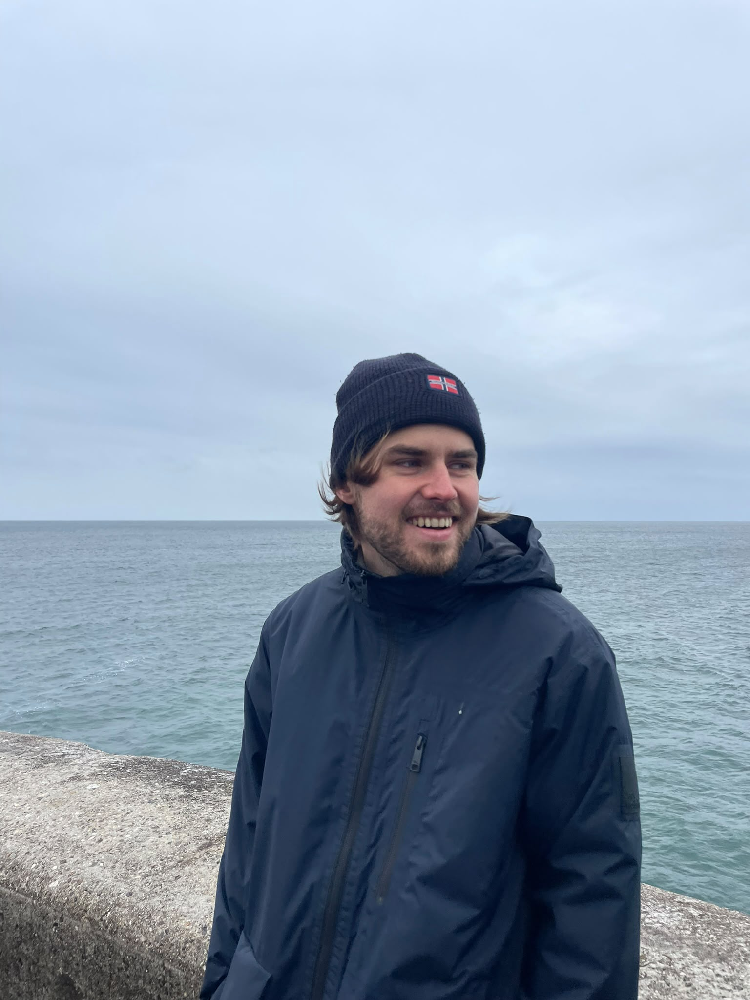

::: {.hero}

::: {.hero-main}

## Me

I am a PhD candidate at CREED at the University of Amsterdam. I studied psychology at the Rijksuniversiteit Groningen and economics at the Tinbergen Institute. 
In my PhD, I will focus on studying feedback mechanisms and confidence management by creating theoretically founded experiments. More generally, I am also interested in contract theory and political economy.

<a href="mailto:n.b.orlik@uva.nl" aria-label="Email" title="Email">
  <i class="bi bi-envelope-fill"></i>
</a>

<a href="https://github.com/nborlik" target="_blank" aria-label="GitHub" title="GitHub">
  <i class="bi bi-github"></i>
</a>

<a href="https://www.linkedin.com/in/nicolas-b-orlik/" target="_blank" aria-label="LinkedIn" title="LinkedIn">
  <i class="bi bi-linkedin"></i>
</a>

<a href="https://orcid.org/0009-0009-3024-4384" target="_blank" aria-label="ORCID" title="ORCID">
  <i class="bi bi-person-badge-fill"></i>
</a>

:::

::: {.profile-box}

{.profile-photo}

:::

:::